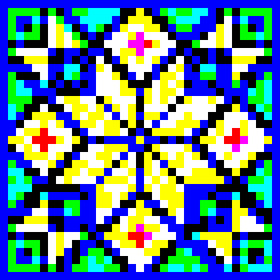

QRnament: Spectral Channel Integrity (SCI)
Deterministic Spectral Response Normalization for Subtractive Media
Project Status: Proof of Concept (PoC)
[Read the full scientific paper on Zenodo](https://zenodo.org/records/18895764)

🎯 The Problem: Inter-Channel Noise in Print
In digital additive environments (RGB), color channels are independent (orthogonal). However, transferring this logic to physical subtractive media (inks/pigments) creates chaos:

Spectral Inconsistency: Pigments never achieve complete suppression of adjacent wavelengths.

Amplitude Imbalance: Different inks have varying maximum reflection levels.

The Result: Multi-channel color QR codes suffer from "cross-talk," making them unreadable for standard sensors and scanners.

💡 The Solution: The SCI Method (by M. Kashkarov)
QRnament is a generator designed to produce data structures optimized for the SCI (Spectral Channel Integrity) model. This model bridges the gap between digital additive logic and physical subtractive physics through:

Adaptive Orthogonalization: Forcing functional independence of reflected channels.

Unified Amplitude Scaling: Establishing fixed Upper and Lower Reference Levels to normalize the signal across all pigments.

Spectral Limiting (Violet Baseline): Using the violet pigment’s unique spectral properties as a natural physical benchmark for system-wide normalization.

🛠 Generator Features
This tool generates Ideal Digital Blueprints for multi-spectral data carriers:

Mandala-Grid Geometry: Optimized data distribution for precision spectral analysis.

RGB Channel Separation: Generates fully independent data layers.

SCI-Ready Output: The images serve as high-fidelity inputs for the SCI deterministic normalization process during printing.

🚀 Commercial & Industrial Potential
The SCI model transforms ordinary reflective surfaces into Deterministic Information Carriers:

High-Density 2D Coding: Multiplies data density by using isolated spectral channels (RGB-independent layers).

Anti-Counterfeit & Brand Protection: Creation of hidden spectral markers that cannot be replicated by standard CMYK scanning or copying.

Multilayer Visuals: Embedding multiple independent images on a single surface, revealed only under specific narrow-band illumination.

📄 Scientific Publication
For the full mathematical model, amplitude normalization charts, and experimental results, please refer to the original paper:
"Universal SCI Model: Deterministic Spectral Response Normalization" — Read on Zenodo
* [Download my vCard](contact.vcf)

© 2026 Mikhail Kashkarov. All rights reserved. The SCI Technology is the intellectual property of the author.
